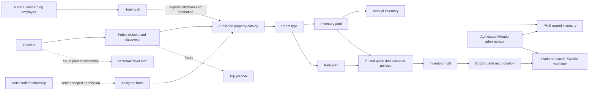

# Domain and ownership relationships

This map distinguishes intended domain relationships from current implemented source. The generated graph remains specific to each checkout; worker commits do not appear in the coordinator until explicitly integrated.

Manual and PMS are alternative pool ownership modes, not concurrent writers. This diagram does not claim quote/hold/payment/live search is enabled.

| Area | Owner / source entry points | Dependencies and boundary |
|---|---|---|
| Public presentation and SEO | Public website task; `apps/web/src/app/page.tsx`, `public.css`, `homepage-controls.tsx` on preview branch | Static reference presentation currently links to legacy pages; no live search/booking claims. Design lead owns accessibility/fidelity acceptance. |
| Hotel access | Administration; `apps/api/app/Policies/HotelPolicy.php`, `Models/Hotel.php`, `Models/User.php`, `routes/web.php` | Membership scopes hotel access; traveller account ownership must not grant hotel or platform powers. |
| Guided onboarding | Administration; `HotelOnboardingController.php`, `SaveOnboardingRequest.php`, web `admin/onboarding.tsx` | Optimistic versions, recoverable drafts, scoped photos; draft rooms/rates are not inventory. No hotel-facing payment/PMS config. |
| Catalog and inventory | Catalog task; room models/resources/migrations in its branch | Stable room/plan IDs, same-hotel photos, one shared stock pool per room. PostgreSQL verification precedes concurrency claims. |
| Bookings | Bookings task; `apps/api/app/ManualQuoteCalculator.php` in its branch | Exact nightly integer money and completeness; per-night eligibility guards remain mandatory. Synthetic inputs are not a live inventory resolver. |
| PMS | PMS task; `tasks/components/pms*.md` in its branch | Provider-specific mappings and sandbox capability evidence; source review only of existing Surge system. |
| Payments | PAYable task; `tasks/components/payments.md` in its branch | Platform-only gateway; current sandbox/docs limitations. No speculative signing/compensation. |
| QA | QA task; `tasks/components/qa.md` | Exact candidate commits, independent tests, regression and bloat review; owner self-tests do not equal independent approval. |
| Design | Design task; `docs/design/` | Existing Niwadu identity plus user-authorized accessibility changes; preview approval is narrower than complete site approval. |

## Current separate task checkouts

Coordinator: `niwadu-v2`, task board at `tasks/team.md`. Component checkouts are siblings under `niwadu-worktrees`: `admin`, `catalog`, `bookings`, `pms`, `payments`, `public-web`, `qa`, `design`. Map each independently, inspect its current branch and report, and do not edit another owner's production source. PO coordinates contracts, integration order and acceptance.

## Cross-cutting product decisions

Property type, geography, themes and sourced star classification are independent. Location alone cannot imply an amenity. Selected dates must affect actual availability before results can claim availability. Traveller map and planner scope choices remain in the archive review pending user answers; do not treat recommendations as approved product defaults.

Public preview approval at `e65d8177e1d63c28eb2b148ccc721f460ec03f06` is frontend-only. Private app recovery and future booking integrations retain their own gates. Always consult newer component reports instead of treating this dated pointer as a live status feed.
